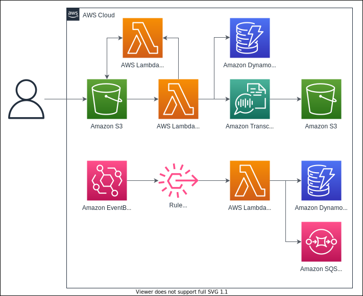

# Video Search

This repo is a sample video search app using AWS services.

## Architecture

### Transcribe


### Generate Subtitle (VTT)


### Code Pipeline


## CDK

```bash
$ npm install

# aws credential setup required.
# on packages/infra
$ cdk deploy PipelineStack

# After deploying the stack, then the CodeCommit repo will be created.
# If you want to deploy this app, you have to push this repo to the CodeCommit repo.
$ git remote add codecommit <CodeCommit-Repo>
$ git push codecommit main
```

## Lambda
- s3-put-object-trigger: 